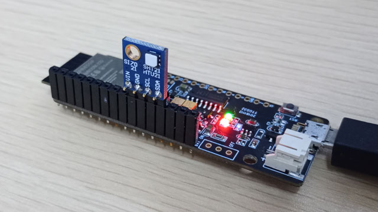

# si7021

Si7021 用 I2Cデータ通信サンプルプログラム by bokunimo.net

## TTGO T-Koala + Si7021

- ESP32搭載TTGO T-Koalaに、Si7021搭載の温湿度センサを直結
- 温度と湿度をシリアルに出力

## 注意

- ソフトを書き込むときは Si7021 を取り外すこと。

## 接続方法

|ピン名|役割      |
|------|----------|
|IO26  |Si7021_VIN|
|IO27  |Si7021_GND|
|IO14  |Si7021_SCL|
|IO12  |Si7021_SDA|

  

## シリアル出力例(正常時)

	Hello!  
	Done: i2c_si7021_Setup  
	ID = 0x15003fff, Si7021  
	Done: Read Electronic ID  
	VER = 0x20, Firmware version 2.0  
	Done: Read Firmware Revision  
	31.3, 74.6  
	31.4, 74.6  
	31.4, 74.4  

## シリアル出力例(エラー時)

	Hello!  
	ERROR: i2c_si7021_Setup Wire.endTransmission  
	Done: i2c_si7021_Setup  
	Done: Read Electronic ID  
	Done: Read Firmware Revision  
	ERROR: i2c_si7021_getTemp() Wire.write hum  
	ERROR: i2c_si7021_getTemp() Wire.write hum  
	-999.0, -999.0  
