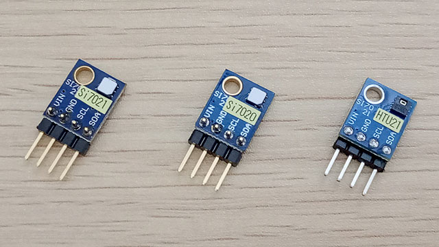
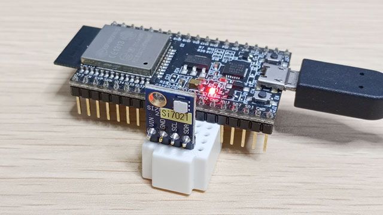

# esp32_si7021 for Si7020, Si7021 and HTU21D

Si7021 用 I2Cデータ通信サンプルプログラム by bokunimo.net

## Supported Devices 対応デバイス

- Silicon Labs Si7020 (±4%)  
- Silicon Labs Si7021 (±3%)  
- Measurement Specialties HTU20D (±5%)  
- Measurement Specialties HTU21D (±3%)  

  

## ESP32 Dev Board + Si7021

- ESP32搭載の各種ボードに、Si7021 / HTU21 搭載の温湿度センサを直結
- 温度と湿度をシリアルに出力

  

### 接続方法

|ピン名|役割      |
|------|----------|
|IO14  |Si7021_SCL|
|IO12  |Si7021_SDA|

## TTGO T-Koala + Si7021

- ESP32搭載TTGO T-Koalaに、Si7021搭載の温湿度センサを直結
- 温度と湿度をシリアルに出力

  

### 注意

- ソフトを書き込むときは Si7021 を取り外すこと。

### 接続方法

|ピン名|役割      |
|------|----------|
|IO26  |Si7021_VIN|
|IO27  |Si7021_GND|
|IO14  |Si7021_SCL|
|IO12  |Si7021_SDA|

## シリアル出力例(Si7021 正常時)

	Hello!
	User Reg = 0x3a
	Done: Read User Reg
	Heater = OFF
	Done: i2c_si7021_Setup
	ID1 = 0x########
	Done: Read Electronic ID
	ID2 = 0x15ffffff, Si7021
	Done: Read Electronic ID
	VER = 0x20, Firmware version 2.0
	Done: Read Firmware Revision
	temp., humid., heater
	31.7, 88.0, 0.0
	31.7, 88.0, 0.0

## シリアル出力例(HTU21 正常時)

	Hello!
	User Reg = 0x3a
	Done: Read User Reg
	Heater = OFF
	Done: i2c_si7021_Setup
	ID1 = 0x########
	Done: Read Electronic ID
	ID2 = 0x32######, HTU21
	Done: Read Electronic ID
	Done: Read Firmware Revision
	temp., humid., heater
	32.1, 63.0, 0.0
	32.1, 61.4, 0.0
	32.0, 61.3, 0.0

## 不具合事例(エラー時)

	Hello!
	Done: Read User Reg
	Heater = OFF
	ERROR: i2c_si7021_Setup Wire.endTransmission
	Done: i2c_si7021_Setup
	Done: Read Electronic ID
	Done: Read Electronic ID
	Done: Read Firmware Revision
	temp., humid., heater
	ERROR: i2c_si7021_getTemp() Wire.write hum
	ERROR: i2c_si7021_getTemp() Wire.write hum
	-999.0, -999.0, 0.0
	ERROR: i2c_si7021_getTemp() Wire.write hum
	ERROR: i2c_si7021_getTemp() Wire.write hum
	-999.0, -999.0, 0.0
